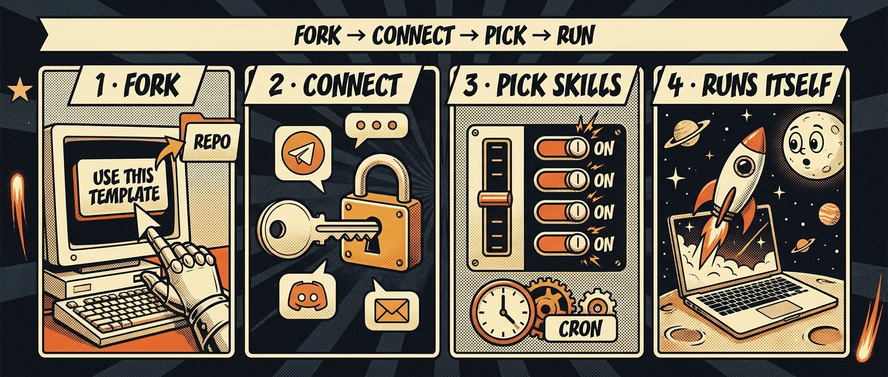
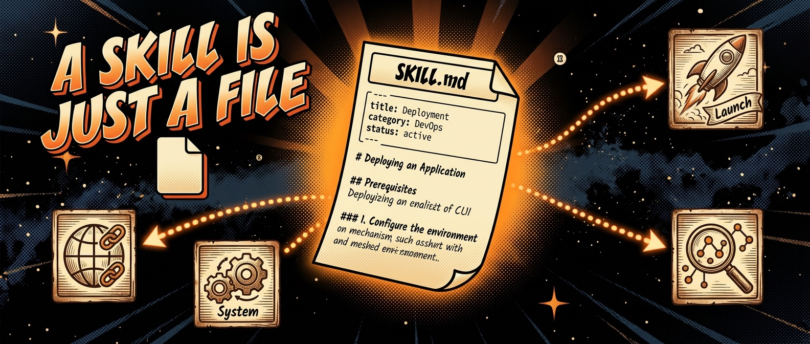
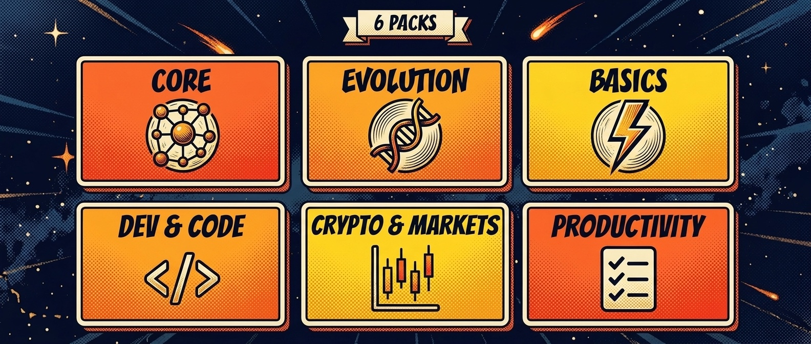
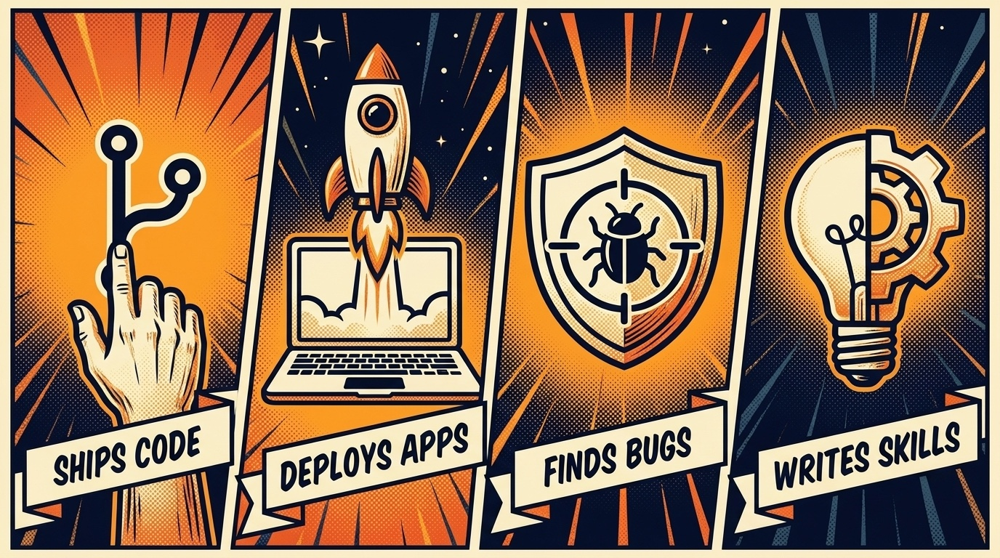
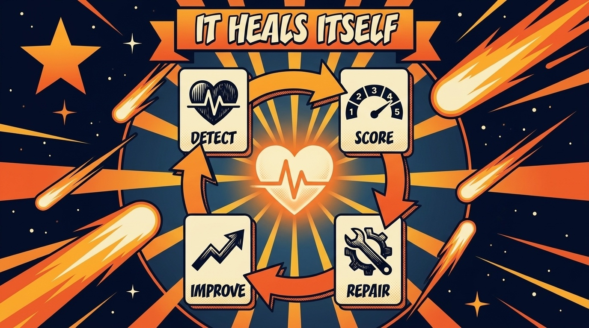
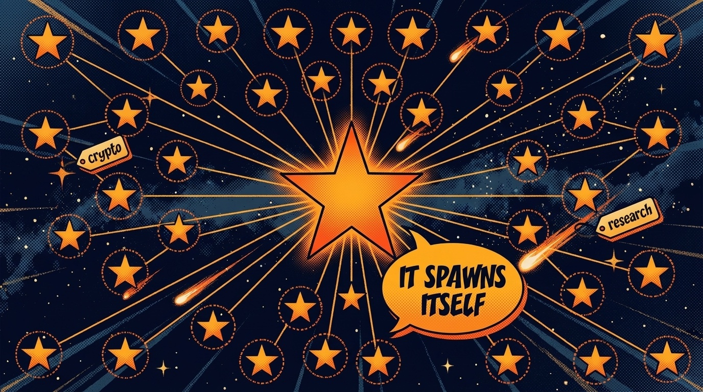
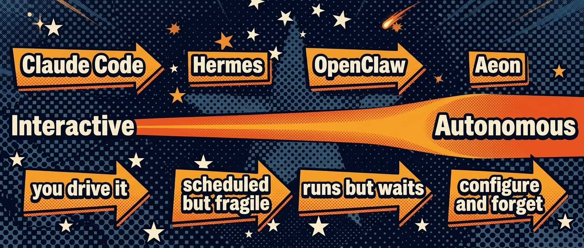
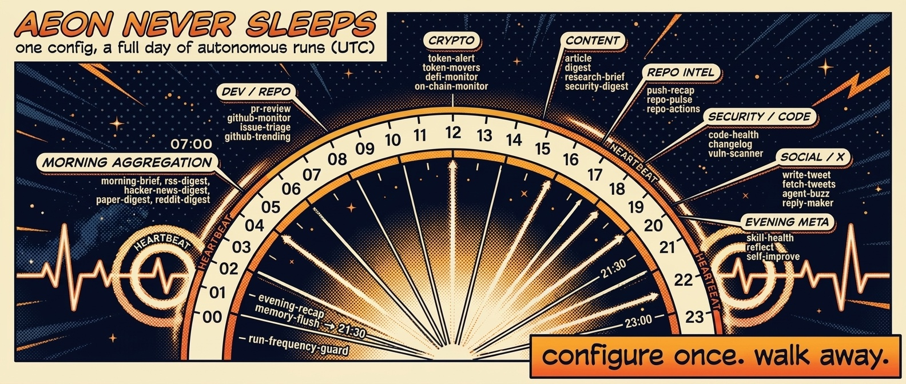

<p align="center">
  
</p>

<p align="center">
  <strong>Star us&nbsp;❤️&nbsp;→</strong>&nbsp;&nbsp;
  <a href="https://github.com/aeonfun/aeon/stargazers"></a>&nbsp;&nbsp;
  <a href="https://www.aeon.fun"></a>&nbsp;&nbsp;
  <a href="https://www.aeon.fun/docs"></a>&nbsp;&nbsp;
  <a href="https://x.com/aeonframework"></a>&nbsp;&nbsp;
  <a href="https://bankr.bot/discover/0xbf8e8f0e8866a7052f948c16508644347c57aba3"></a>
</p>

<p align="center">
  Give it a direction and it ships the work: features, vulnerability disclosures, live apps, deep research - and new skills for itself.<br/><br/>
  <strong>No approval loops. No babysitting. Configure once, forget forever.</strong>
</p>

<div align="center">

[](https://github.com/aeonfun/aeon/stargazers)
[](https://github.com/aeonfun/aeon/network/members)
[](../LICENSE)
[](https://nodejs.org/)

</div>

<p align="center">
  
</p>

---

## Quick start

<p align="center">
  
</p>

You need **Node.js 20+**, the **[GitHub CLI](https://cli.github.com/) (`gh`)** authenticated (`gh auth login`), and **your own copy** - click **Use this template** on [the repo page](https://github.com/aeonfun/aeon) (keep it public; Actions minutes are free), or `gh repo fork aeonfun/aeon --clone`.

```bash
git clone https://github.com/<you>/aeon   # skip if you used `gh repo fork --clone`
cd aeon && ./aeon
```

Open [localhost:5555](http://localhost:5555) and follow the dashboard: **Authenticate** (any of six [harnesses](../docs/harnesses.md)) → **add a channel** → **pick skills** → **Run**. That's it - Aeon runs unattended. Everything is also an `./aeon` command ([CLI](../apps/cli/README.md)) or a `/aeon` chat command ([setup skill](../docs/aeon-setup.md)).

<details>
<summary><strong>No admin rights / can't install <code>gh</code>?</strong></summary>

Grab the `gh_*_macOS_arm64.zip` (or your platform's binary) from [github.com/cli/cli/releases](https://github.com/cli/cli/releases) and drop it on your `PATH` (e.g. `~/.local/bin`). Then `gh auth login`.

</details>

---

## What Aeon can do

<p align="center">
  
</p>

**A skill is a Markdown file: some frontmatter, then a prompt.** No plugin API, nothing to compile. Here's a real one, trimmed:

```yaml
# skills/digest/SKILL.md
---
name: digest
category: basics                 # which pack it belongs to
description: Generate and send a digest on a configurable topic
requires: [XAI_API_KEY?]         # ? = optional key, bare = required
var: ""                          # per-run input - "solana", "rust", "AI agents"…
mode: write
---
```

The prompt *is* the skill. You schedule it, hand it a `var`, chain it into others, and Haiku rates every run. How packs work: [`docs/skill-packs.md`](../docs/skill-packs.md).

<p align="center">
  
</p>

<p align="center"><a href="../docs/skill-packs.md#full-catalog-all-67-skills-by-pack"><b>Full catalog - all 67 skills by pack →</b></a></p>

### It ships real work

<p align="center">
  
</p>

`feature` ships code to your repos, `deploy-prototype` ships live apps to Vercel, `vuln-scanner` finds and privately discloses real vulnerabilities, `create-skill` writes new skills from a sentence. How each works: [`CORE.md`](../docs/CORE.md).

### It heals itself



Haiku scores every run 1–5; `heartbeat` → `skill-health` → `skill-repair` → `self-improve` detect and fix broken skills without you, and `aeon-doctor` lints the config itself. How the loop closes: [`CORE.md`](../docs/CORE.md).

### It replicates

<p align="center">
  
</p>

`spawn-instance` forks Aeon into a new specialized instance (`var: "crypto-tracker: monitor DeFi protocols"`), picks relevant skills, and registers it - no secrets propagated, billing isolated. `fleet-control` health-checks and dispatches across the fleet.

### Add more skills

```bash
bin/add-skill aeonfun/aeon --list        # browse the built-in catalog
bin/add-skill BankrBot/skills bankr hydrex  # install from any GitHub repo
bin/add-skill BankrBot/skills --all         # install everything from a repo
bin/export-skill token-movers               # package one for standalone use
```

Installed skills land in `skills/` disabled - flip `enabled: true`. Or build your own from a [template](../docs/examples/skill-templates/TEMPLATE.md), drop a [portable workflow](../docs/examples/workflow-templates) into any repo, or label an issue `ai-build` and Claude opens the PR. More: [`skill-packs.md`](../docs/skill-packs.md).

---

## Proof of work

Aeon's skills ship to production. These numbers are live at **[aeon.fun](https://www.aeon.fun)**.

| Skill | In production |
|-------|---------------|
| **`vuln-scanner`** | **~1.6M GitHub stars secured** - real vulnerabilities found, patched, and responsibly disclosed across 54 open-source projects (31 rated High/Critical). [Every disclosure →](https://www.aeon.fun/security) |
| **ecosystem** | **72 products & agents** built on Aeon. [`ECOSYSTEM.md`](../docs/ECOSYSTEM.md) |
| **community** | **12 community skill packs** published to the registry. [`community-skill-packs.md`](../docs/community-skill-packs.md) |

---

## Guardrails

<p align="center">
  
</p>

Read-only skills can't touch the repo, irreversible actions fail closed, an optional [Fleet Watcher](../docs/CONFIGURATION.md#fleet-watcher-authorization-layer) gates every run, and secrets stay off the command line. Details: [Configuration](../docs/CONFIGURATION.md#capability-tiers-read-only-skills).

---

## Why "the most autonomous"

Most agent tools keep you in the loop - approve this call, review this diff. Aeon is built for the work you want done while you're away, and it's the only framework that does all four unattended: runs on a schedule, remembers across runs, reacts to conditions, and repairs its own broken skills. The most autonomous agent is the one that never asks.

Full comparison vs AutoGen, CrewAI, n8n, and LangGraph: [`SHOWCASE.md`](../docs/SHOWCASE.md).



---

## Configure

<a href="../docs/CONFIGURATION.md"></a>

Everything lives in `aeon.yml` - schedules (standard UTC cron), the per-skill `var` input, model, auth, notification channels, and API keys:

```yaml
skills:
  digest:
    enabled: true
    schedule: "0 14 * * *"    # daily 2pm UTC
    var: "solana"             # per-run input
```

Full reference - scheduling, `var`, models, [authentication](../docs/CONFIGURATION.md#authentication), [notification channels](../docs/CONFIGURATION.md#notifications), API keys, guardrails: **[Configuration](../docs/CONFIGURATION.md)**.

---

## Community Packs


> Aeon's **built-in (first-party) packs** - Core, Evolution, Basics, Dev, Crypto, Productivity - live in this repo and are enabled from the dashboard's **Packs** view; see [`docs/skill-packs.md`](../docs/skill-packs.md). The packs below are **community** collections in their own repos.

Third-party collections in their own repos. Install one-click from the **Packs** view or `bin/install-skill-pack <repo>` - the installer security-scans each `SKILL.md` and lands the pack disabled. Schema, trust model, and publishing: [`community-skill-packs.md`](../docs/community-skill-packs.md).

| Pack | Skills | Description |
|------|--------|-------------|
| [aeon-skills](https://github.com/AntFleet/aeon-skills) | 2 | Two-model-consensus PR review (Opus 4.7 + GPT-5), x402 pay-per-call for public repos. |
| [aeon-skill-pack-liquidpad](https://github.com/liquidpadbot/aeon-skill-pack-liquidpad) | 4 | Track LiquidPad on Base: burn alerts, launches, digest, fee accrual. |
| [aeon-skill-pack-mythosforge](https://github.com/ryjin111/aeon-skill-pack-mythosforge) | 5 | Read-only MythosForge monitoring: ops/jury/payout health and proof-of-creation integrity on Base. |
| [signa](https://github.com/codexvritra/signa) (`--path aeon-skills`) | 20 | Wallet-signed cross-platform agent messaging, encrypted rooms, and x402 bounded-spend mandates. |
| [Atrium Skills](https://github.com/Atrium-Hermes/aeon-atrium-skills) | 3 | Publish, rent, and earn from agent skills on Atrium, the onchain skill marketplace on Base. |
| [aeon-skill-pack-mneme](https://github.com/mnemedb/aeon-skill-pack-mneme) | 8 | Persistent memory layer: vector recall, entity graph, and Base chain streams. One key, zero infra. |
| [clawhunter-skills](https://github.com/clawhunter/clawhunter-skills) | 2 | Aggregates and AI-triages crypto bounties across venues; paid research/create tools settle via x402. |
| [Polymarket Trader by Simmer](https://github.com/SpartanLabsXyz/aeon-skill-pack-polymarket/tree/main/aeon-skill-pack) (`--path aeon-skill-pack`) | 3 | Signal, discovery, and real order-placing on Polymarket (simulate-by-default, live opt-in). |
| [Charon for AEON](https://github.com/CharonAI-code/charon/tree/main/skills/aeon) (`--path skills/aeon`) | 2 | Repo-local policy enforcement for AEON runs, with natural-language policy management. |
| [aeon-skill-pack-agentlink](https://github.com/techdigger/aeon-skill-pack-agentlink) | 1 | Verified, human-backed on-chain identity on Base via AgentLink. Read-only, on-demand. |
| [AI2Human Create Task](https://github.com/richard7463/ai2human-aeon-skill-pack) | 1 | Route a blocked human step to AI2Human: dispatch human execution, then follow the proof, verify, settle loop before USDC payout. |
| [aeon-skill-pack-skim](https://github.com/JessieJanie/aeon-skill-pack-skim) | 1 | Pay-per-call clean web reads via Skim x402: any URL to markdown ~4x smaller than raw HTML, $0.002 USDC on Base, no API key. |

---

## Integrate Aeon

An Aeon instance is just a GitHub repo + Actions, so **GitHub's API is Aeon's API** - one GitHub App drives your users' instances (dispatch skills, edit config, write sealed secrets) with no PATs or LLM billing on your side.

<div align="center">
  
</div>

Full walkthrough - App setup, tenant isolation, driving skills, shipping your own pack: **[ADK - Aeon Developer Kit](../docs/ADK.md)**.

---

## Docs

Everything above gets you running. The deep reference lives in [`docs/`](../docs) - jump in:

<p align="center">
  <a href="../docs/CONFIGURATION.md"></a>&nbsp;
  <a href="../docs/harnesses.md"></a>&nbsp;
  <a href="../docs/skill-packs.md"></a>&nbsp;
  <a href="../docs/CORE.md"></a>
</p>
<p align="center">
  <a href="../apps/cli/README.md"></a>&nbsp;
  <a href="../apps/mcp-server/README.md"></a>&nbsp;
  <a href="../apps/webhook/README.md"></a>&nbsp;
  <a href="../docs/ADK.md"></a>&nbsp;
  <a href="../docs/ECOSYSTEM.md"></a>
</p>

---

<p align="center"><sub>MIT · Support the project: <code>0xbf8e8f0e8866a7052f948c16508644347c57aba3</code> ⭐</sub></p>
